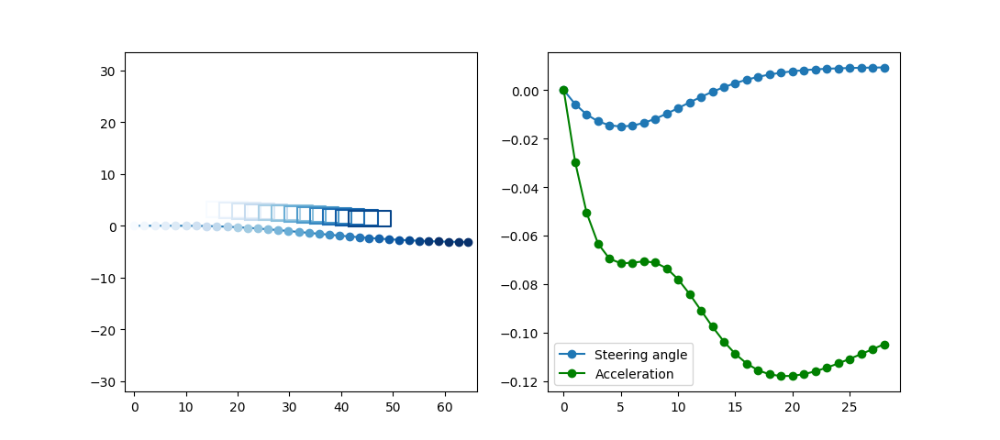

# Dynamic Trajectory Optimizer

This library provides a highly modular and easy to use trajectory optimization library for autonomous agents.
There are several dynamic models and integration methods that can be used in the optimization.
The underlying solver is the [ceres-solver](http://ceres-solver.org/) capable of solving unconstrained optimization problems.

Implemented models:

* Simplified single track model
* Null model

Implemented integration methods:

* Explicit Euler method
* Runge-Kutta method (4th order)

## Getting Started

As prerequistite you need [bazel](http://bazel.build/) and [Python 3.6](https://www.python.org/downloads/release/python-360/).
Set-up a virtual python environment and enter it by using these commands: `bash install.sh` and  `bash dev_into.sh`.
Once you are in the virtual environment run `bazel test //...` to verify the functionality is as intended. 
In order to obtain an exemplary output run the command `bazel run //tests:py_optimizer_single_track_tests`.

(C) Copyright by Patrick Hart (patrick.hart@tum.de)